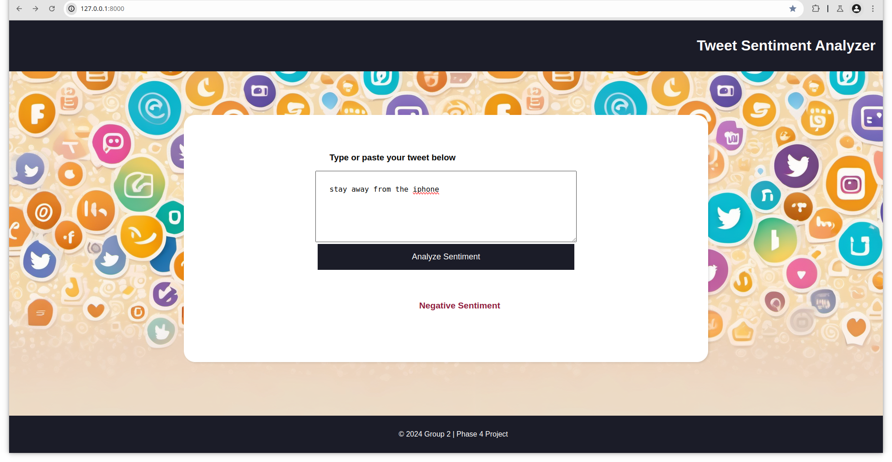
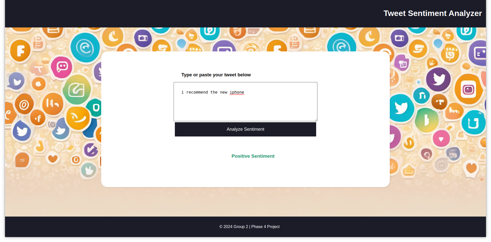
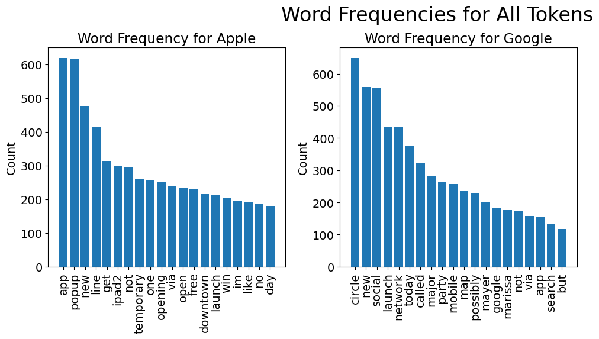
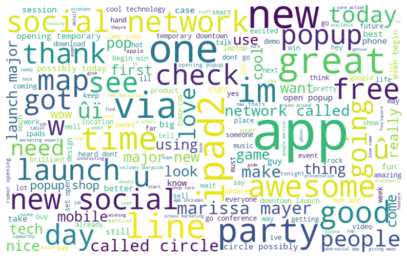
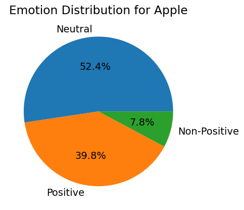

# Wowshop Tweet Sentiment Analysis
- Team: Tabitha Berum, Jacinta Chepkemoi, Christine Malinga, Ian Musau
- Course: DSC Hybrid
## Overview
Wowshop, an e-commerce company, operates in a competitive market where customer satisfaction is crucial. Customers frequently tweet about their experiences with Wowshop, including order issues, product reviews, and customer service interactions. The company wants to enhance its customer service by quickly identifying and addressing customer issues mentioned on Twitter, improving overall service quality, and increasing customer retention.

They have tasked the team with creating a proof of concept that showcases tweet sentiment analysis. The team created a model that can read tweets and assess whether it is positive or otherwise. A simple web app was also developed to showcase the model at work. Upon delivery it will be assessed and the project can move forward.

Problems that surface during development mainly concern the small size of the dataset for training an effective and robust model. With a larger dataset, even better results can be achieved.

<b>Below are screenshots of the demo:</b>
   

### Technologies
- Python
- NLTK
- Pandas
- Scikit
- Matplotlib
- Seaborn
- FastAPI

## Business Problem
The aim of the project is to create a model that can answer:
- How do customers feel about a product?
- What is the consensus about the storefront?
- Which products are worth restocking and dropping?

## Data Understanding
The training dataset was sourced from the CrowdFlower and is stored in a csv.
1. The dataset contains 9,092 tweets related to the products from Google and Apple.
2. The dataset has 3 features, namely the tweet, the associated product and the emoticon conveyed.

## Visualizations

## Evaluation
The Naive Bayes model is chosen to be deployed to the demostration. Below is a breakdown of its performance. We will review several metrics including accuracy, precision, recall and F1-score to understand how well the model performs and identify areas for improvement.

### 1. **Evaluation Metrics**

**Overall Accuracy:**  
The model achieves an accuracy of **87.25%**, meaning it correctly classifies 87.25% of the tweets.

**Precision, Recall, and F1-Score:**  
Here’s the detailed performance of the model for each class:

- **Class 0 (Negative Sentiment):**
  - **Precision:** 0.48
  - **Recall:** 0.67
  - **F1-Score:** 0.56
  - **Support:** 43 samples

- **Class 1 (Positive Sentiment):**
  - **Precision:** 0.95
  - **Recall:** 0.90
  - **F1-Score:** 0.93
  - **Support:** 310 samples

**Macro Average:**
  - **Precision:** 0.72
  - **Recall:** 0.79
  - **F1-Score:** 0.74

**Weighted Average:**
  - **Precision:** 0.90
  - **Recall:** 0.87
  - **F1-Score:** 0.88

### 2. **Performance Analysis**

- **Class-wise Performance:**
  - The model performs very well on the positive sentiment class (Class 1), with high precision (0.95), recall (0.90), and F1-score (0.93). This indicates that the model is highly effective at identifying positive sentiments.
  - However, the performance on the negative sentiment class (Class 0) is weaker, with precision at 0.48, recall at 0.67, and F1-score at 0.56. This suggests that the model struggles to accurately identify negative sentiments compared to positive ones.

- **Overall Performance:**
  - The model has high overall accuracy (87.25%) and weighted averages for precision, recall, and F1-score are quite strong. This indicates that despite the model’s struggle with negative sentiment classification, it still performs well overall due to the higher number of positive sentiment tweets.

### 3. **Model Limitations**

- **Bias Towards Positive Sentiment:**
  - The model shows a significant bias towards positive sentiment due to the imbalance in the dataset (more positive samples). 

- **Data Representation:**
  - If negative sentiments are underrepresented in the training data, the model might struggle with identifying such sentiments accurately.

### 4. **Suggestions for Improvement**

- **Data Augmentation:**
  - Increase the representation of negative sentiment examples in the training dataset to help the model learn better characteristics of negative sentiments.
  - Consider techniques like data synthesis. By using existing tweets and applying sentiment analysis techniques to generate synthetic negative examples, a more robust dataset could be created.

## Conclusion
The sentiment analysis model demonstrates strong performance in classifying positive sentiments but needs improvement in accurately identifying negative sentiments. Addressing the imbalance in the dataset could enhance overall performance. The substantial difference in performance between positive and negative sentiment necessitates improving classification for negative sentiment.

With an accuracy greater than 80% the model does well to identify tweet sentiment. It is worthwhile to pursue this further and use the analysis to collect customer opinion on products.

